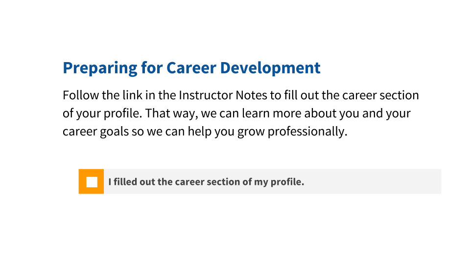
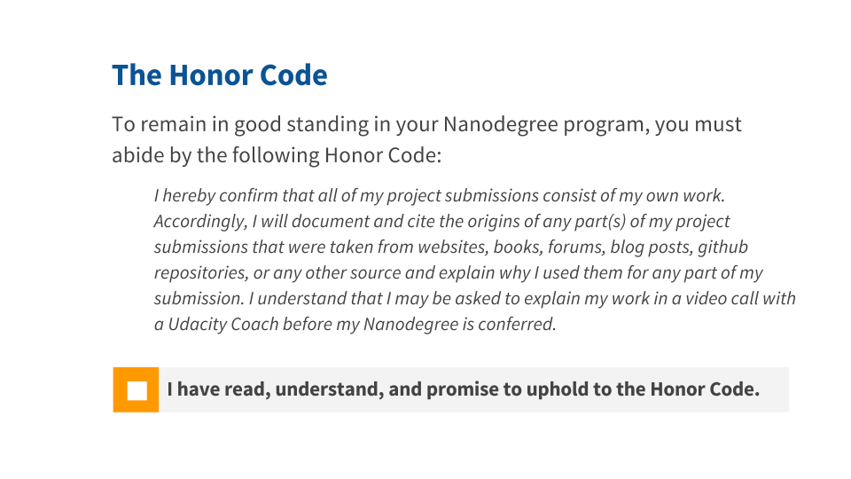
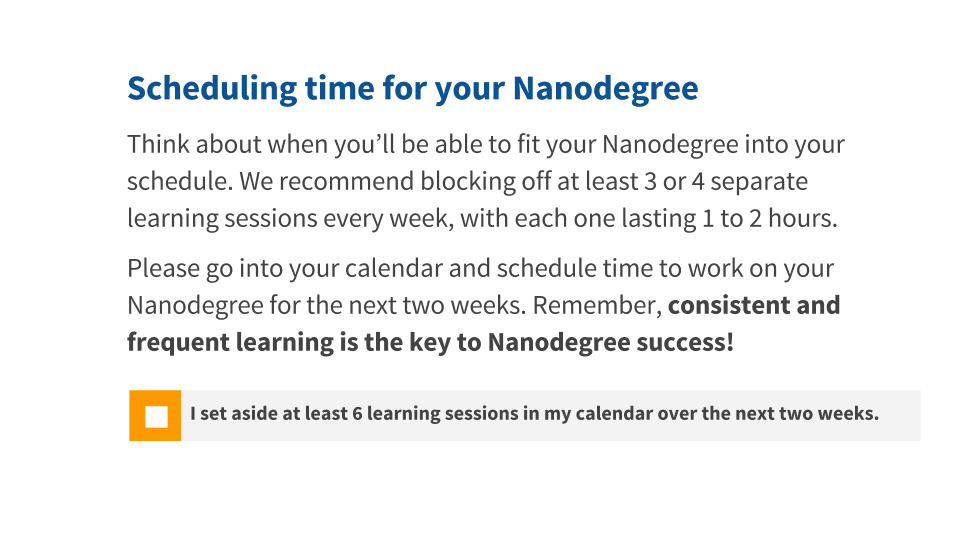

# Welcome to the Nanodegree

- Get started on your Nanodegree and learn how to make the most of Udacity's resources!

- 2 Lessons
- WELCOME TO THE NANODEGREE 
  - [x]Welcome To The Data Analyst Nanodegree `6 minutes` `0/1`
  - [x]Nanodegree Orientation `0/11`
      - [Introduction](#introduction)
      - [Projects and Progress](#projects-and-progress)
      - [Quiz: Career Development Oppertunities](#quiz:-career-development-oppertunities)
      - [Connecting with your community](#connecting-with-your-community)
      - [Support from the Udacity Team](#support-from-the-udacity-team)
      - [How Does Project Submission Work?](#how-does-project-submission-work?)
      - [Quiz: Integrity And Mindset](#quiz-integrity-and-mindset)
      - [What If I Want To Move Faster?](#what-if-i-want-to-move-faster?)
      - [Quiz: How Do I Find Time For My Nanodegree?](#quiz:-how-do-i-find-time-for-my-nanodegree?)
      - [Final Tips](#final-tips)
      - [Wrapping Up](#wrapping-up)

## Introduction
- simple `16s` video. 
- Let's dive in!

## Projects and Progress
- Overview.
- project, lecture, career, etc.
- You can get massive changes within a few months.
    

## Quiz: Career Development Oppertunities

- Make your Udacity profile to be supported by udacity career team.
- Salery, location, desired role, etc.

## Connecting with your community
- Nanodegree would be big challenge.
- Get a help from community.
- Go to forum. Ask and answer with coach and other students.
- So don't be shy.

## Support from the Udacity Team
- Access these support systems by clicking on the Resources link at the top of Nanodegree classroom.    
    - Forums
    - 1:1 Appointments
    > [Scheduling One on One Appointments](https://discussions.udacity.com/t/scheduling-one-on-one-appointments/17158?_ga=1.2956720.1212536709.1470233261)
    
    - Webcasts

 

## How Does Project Submission Work?
- Project is important during learning process.
- You can get feedback of your project.
- Expert engineer can't write perfect code at once.
- So repeat till understanding.
- You can submit your project many times as you want.

## Quiz: Integrity And Mindset

## What If I Want To Move Faster?
- Don't mind.

## Quiz: How Do I Find Time For My Nanodegree?

- The most successful udacity students work on their courses and projects multiple times a week, not just in one big chunk.

## Final Tips

1. Stick to your schedule
2. Be relentless in searching for an answer on your own
3. Be an active member of your community

## Wrapping Up
You now have all the info you need to proceed on your Nanodegree journey!

- If you have any further questions, perhaps about payment or enrollment, check the Udacity [FAQ](https://udacity.zendesk.com/hc/en-us) for more details.
- Download Udacity's [mobile app](https://www.udacity.com/mobile?_ga=1.215494679.1212536709.1470233261) to learn on the go!
- Remember to put in time consistently, engage with your community, take advantage of the resources available to you, and give us feedback throughout the program.

We are so glad to have you with us. Keep up your learning, and good luck!